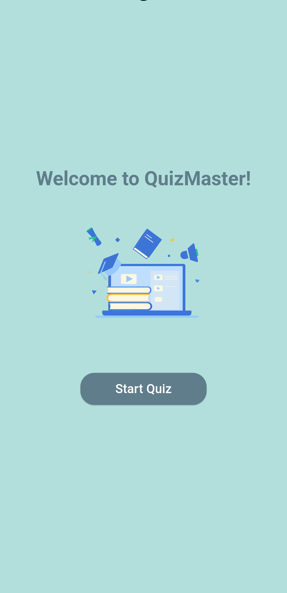
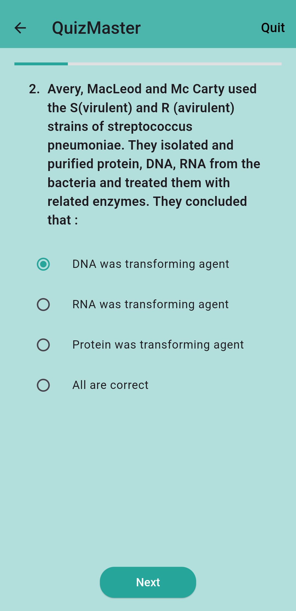
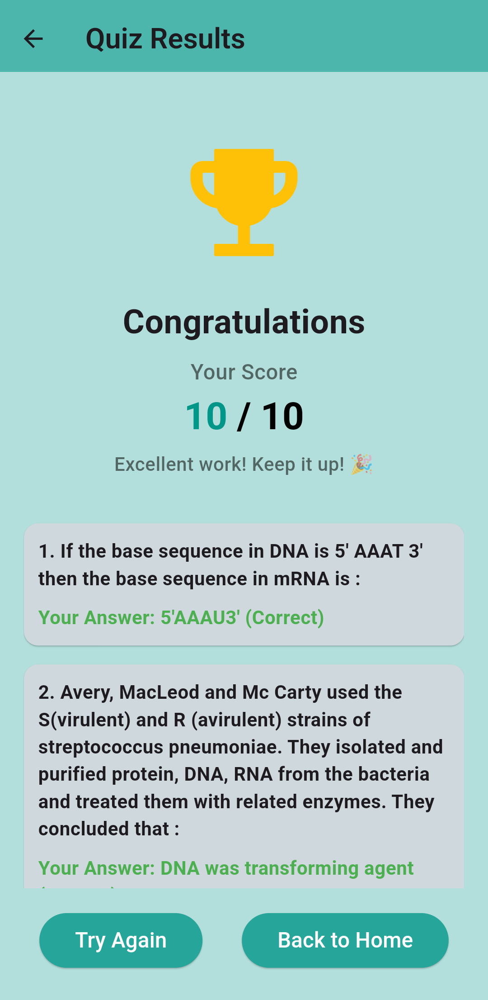

# QuizMaster

## Overview

This project is a Flutter-based Quiz Application that incorporates gamification features to make learning engaging and fun. The app retrieves quiz data from an external API and uses Provider for state management, focusing on clean code and an intuitive user interface.

## Task Details

## Features

### Gamification:

Points system for correct answers.

Progress tracking with scores displayed at the end of each quiz.

Visual feedback for correct and incorrect answers.

## Dynamic Quizzes:

Fetches quiz data from an external API.

Supports multiple types of questions.

## User Experience:

Smooth animations and responsive design.

Simple and intuitive navigation.

## State Management:

Provider is used to manage the state of the application, ensuring scalability and maintainability.

## Technologies Used

Framework: Flutter

State Management: Provider

Backend Integration: HTTP requests to an external API

Design Patterns: SOLID principles and clean architecture

Animations: Flutter animation framework

## Screenshots

### Home Page

### Quiz Page

### Result Page

## Screen Recording
[Link to the video](assets/Quiz_App.mp4)

## Installation

## Clone the repository:

git clone https://github.com/yourusername/Quiz_App.git

## Navigate to the project directory:

cd quiz_app

## Install dependencies:

flutter pub get

## Run the application:

flutter run

## Folder Structure

lib/
|
|-- models/         # Data models for parsing API responses
|-- providers/      # State management logic using Provider
|-- screens/        # UI screens for different parts of the app
|-- services/       # API handling and business logic
|-- widgets/        # Reusable widgets for modular code
|-- utils/          # Helper functions and constants

## How to Use

Open the app and start a new quiz.

Answer each question, and your score will be updated in real time.

View your final score and progress at the end of the quiz.

Troubleshooting

If you encounter issues like missing scores or API failures, follow these steps:

Debugging API Responses: Ensure the API returns the expected quiz data. Use logs to verify the response.

State Updates: Check that Provider correctly updates the state.

Widget Refresh: Ensure UI widgets rebuild properly when state changes.

## Future Enhancements

Add user authentication and profile management.

Implement leaderboard functionality.

Include offline mode with local data storage.

Add support for multiple languages.

## Contributing

Contributions are welcome! Feel free to submit a pull request or open an issue.

## License

This project is licensed under the MIT License. See the LICENSE file for details.